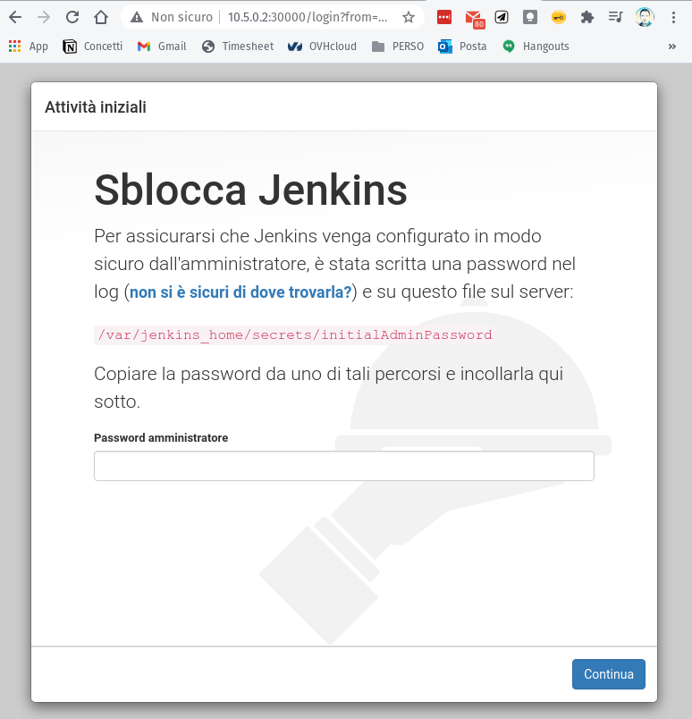
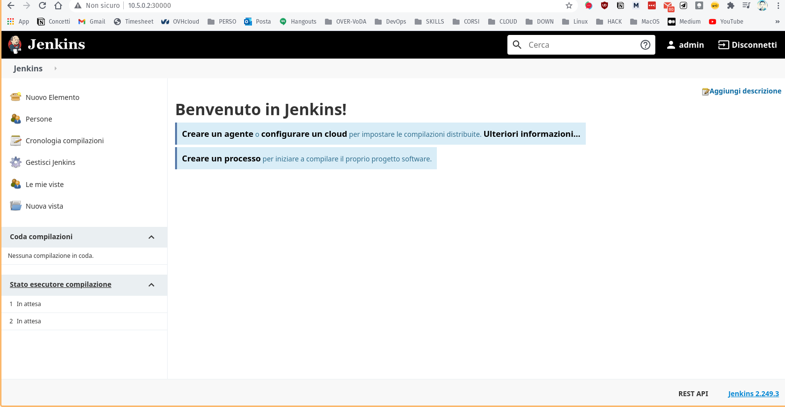

# Jenkins on K8S-TALOS Cluster

## Installation test on linux [POP_OS 20.10](https://pop.system76.com/) - Ubuntu Distro Fork

**This is a tutorial - guide to install a Jenkins instance on a [Kubernetes](https://kubernetes.io/) cluster based on [TALOS OS](http://talos.dev)** 

### requirements to be installed :

1. **Docker (v. 19.02 o sup.)** 
2. **Kubectl (v. GitVersion:"v1.19.3")**
3. **Talos (talosclt ver. 0.70 beta)**

### Docker installation :

Provided that docker repos are installed, Otherwise follow the points in  : 

[Install Docker Engine on Ubuntu](https://docs.docker.com/engine/install/ubuntu/)

```bash
sudo apt-get update
sudo apt-get install docker-ce docker-ce-cli containerd.io

❯ docker --version
Docker version 19.03.13, build 4484c46
```

### Installazione di **Kubectl** :

[Install and Set Up kubectl](https://kubernetes.io/docs/tasks/tools/install-kubectl/)

```bash
❯ sudo snap install kubectl --classic

[sudo] password di pippo: 
Setup snap "snapd" (9721) security profiles                                                       2020-11-12T14:15:32+01:00 INFO Waiting for automatic snapd restart...
kubectl 1.19.3 from Canonical✓ installed

❯ kubectl version --client
Client Version: version.Info{Major:"1", Minor:"19", GitVersion:"v1.19.3", GitCommit:"1e11e4a2108024935ecfcb2912226cedeafd99df", GitTreeState:"clean", BuildDate:"2020-10-20T14:12:21Z", GoVersion:"go1.15.3", Compiler:"gc", Platform:"linux/amd64"}

In ALTERNATIVA SE NON E' PRESENTE SNAPD, procedere :

❯sudo apt-get update && sudo apt-get install -y apt-transport-https gnupg2 curl
❯curl -s https://packages.cloud.google.com/apt/doc/apt-key.gpg | sudo apt-key add -
❯echo "deb https://apt.kubernetes.io/ kubernetes-xenial main" | sudo tee -a /etc/apt/sources.list.d/kubernetes.list
❯sudo apt-get update
❯sudo apt-get install -y kubectl
```

### **Installazione di Talosctl :**

[Quickstart](https://www.talos.dev/docs/v0.7/introduction/quickstart/)

```bash
❯ curl -Lo /usr/local/bin/talosctl https://github.com/talos-systems/talos/releases/latest/download/talosctl-$\(uname -s | tr "[:upper:]" "[:lower:]")-amd64
zsh: parse error near `)'

N.B : Se restituisce errore, andare al link :[https://github.com/talos-systems/talos/release https://github.com/talos-systems/talos/releases](https://github.com/talos-systems/talos/releases)
ed inserire il link corrispondente alla versione amd64 : https://github.com/talos-systems/talos/releases/download/v0.7.0-beta.1/talosctl-linux-amd64

❯ curl -Lo /usr/local/bin/talosctl https://github.com/talos-systems/talos/releases/download/v0.7.0-beta.1/talosctl-linux-amd64

❯ sudo chmod +x /usr/local/bin/talosctl
```

### Creazione del CLUSTER Kubernetes :

```bash
❯ talosctl cluster create --wait

validating CIDR and reserving IPs
generating PKI and tokens
creating network talos-default
creating master nodes
creating worker nodes
waiting for API
bootstrapping cluster
waiting for etcd to be healthy: OK
waiting for bootkube to finish: OK
waiting for apid to be ready: OK
waiting for kubelet to be healthy: OK
waiting for all k8s nodes to report: OK
waiting for all k8s nodes to report ready: OK
waiting for all control plane components to be ready: OK
waiting for kube-proxy to report ready: OK
waiting for coredns to report ready: OK
waiting for all k8s nodes to report schedulable: OK

merging kubeconfig into "/home/pippo/.kube/config"
renamed cluster "talos-default" -> "talos-default-1"
renamed auth info "admin@talos-default" -> "admin@talos-default-1"
renamed context "admin@talos-default" -> "admin@talos-default-1"
PROVISIONER       docker
NAME              talos-default
NETWORK NAME      talos-default
NETWORK CIDR      10.5.0.0/24
NETWORK GATEWAY   10.5.0.1
NETWORK MTU       1500

NODES:

NAME                      TYPE           IP         CPU    RAM      DISK
/talos-default-master-1   controlplane   10.5.0.2   2.00   2.1 GB   -
/talos-default-worker-1   join           10.5.0.3   2.00   2.1 GB   -

❯ talosctl config nodes 10.5.0.2

❯ kubectl --kubeconfig kubeconfig config set-cluster talos-default --server https://127.0.0.1:6443

****Cluster "talos-default" set.Cluster "talos-default" set.

❯ talosctl containers
NODE       NAMESPACE   ID         IMAGE                                  PID   STATUS
10.5.0.2   system      apid       talos/apid                             196   RUNNING
10.5.0.2   system      etcd       gcr.io/etcd-development/etcd:v3.4.12   274   RUNNING
10.5.0.2   system      networkd   talos/networkd                         88    RUNNING
10.5.0.2   system      routerd    talos/routerd                          89    RUNNING
10.5.0.2   system      trustd     talos/trustd                           207   RUNNING

❯ kubectl get node
NAME                     STATUS   ROLES    AGE   VERSION
talos-default-master-1   Ready    master   39m   v1.19.3
talos-default-worker-1   Ready    <none>   39m   v1.19.3
```

### Comandi - Esempi :

```bash
**❯** talosctl containers -k

NODE       NAMESPACE   ID                                                                              IMAGE                                                                                                              PID    STATUS
10.5.0.2   k8s.io      kube-system/coredns-54fb6ddb8b-pbwcl                                            k8s.gcr.io/pause@sha256:927d98197ec1141a368550822d18fa1c60bdae27b78b0c004f705f548c07814f                           1761   RUNNING
10.5.0.2   k8s.io      └─ kube-system/coredns-54fb6ddb8b-pbwcl:coredns                                 k8s.gcr.io/coredns@sha256:73ca82b4ce829766d4f1f10947c3a338888f876fbed0540dc849c89ff256e90c                         1916   RUNNING
10.5.0.2   k8s.io      kube-system/kube-apiserver-jnm4b                                                k8s.gcr.io/pause@sha256:927d98197ec1141a368550822d18fa1c60bdae27b78b0c004f705f548c07814f                           1039   RUNNING
10.5.0.2   k8s.io      └─ kube-system/kube-apiserver-jnm4b:kube-apiserver                              k8s.gcr.io/kube-apiserver-amd64@sha256:f7a125197ee7f68c21b319bd4422d2492c5efb02f76f46ed8918cf7e12566570            2360   RUNNING
10.5.0.2   k8s.io      kube-system/kube-controller-manager-sf6dv                                       k8s.gcr.io/pause@sha256:927d98197ec1141a368550822d18fa1c60bdae27b78b0c004f705f548c07814f                           1835   RUNNING
10.5.0.2   k8s.io      └─ kube-system/kube-controller-manager-sf6dv:kube-controller-manager            k8s.gcr.io/kube-controller-manager-amd64@sha256:29dfffa60c8c6858800732b65d775e03ebd3e5dab30fa0439d6f77e668b699c3   1868   RUNNING
10.5.0.2   k8s.io      kube-system/kube-flannel-z5m7h                                                  k8s.gcr.io/pause@sha256:927d98197ec1141a368550822d18fa1c60bdae27b78b0c004f705f548c07814f                           815    RUNNING
10.5.0.2   k8s.io      └─ kube-system/kube-flannel-z5m7h:kube-flannel                                  quay.io/coreos/flannel@sha256:6d451d92c921f14bfb38196aacb6e506d4593c5b3c9d40a8b8a2506010dc3e10                     1647   RUNNING
10.5.0.2   k8s.io      kube-system/kube-proxy-gb2st                                                    k8s.gcr.io/pause@sha256:927d98197ec1141a368550822d18fa1c60bdae27b78b0c004f705f548c07814f                           808    RUNNING
10.5.0.2   k8s.io      └─ kube-system/kube-proxy-gb2st:kube-proxy                                      k8s.gcr.io/kube-proxy-amd64@sha256:37fbe956db3b1a9411bad993c46f9f9f11caa10fcdc5128a483fb1007868d310                853    RUNNING
10.5.0.2   k8s.io      kube-system/kube-scheduler-kt4j8                                                k8s.gcr.io/pause@sha256:927d98197ec1141a368550822d18fa1c60bdae27b78b0c004f705f548c07814f                           2044   RUNNING
10.5.0.2   k8s.io      └─ kube-system/kube-scheduler-kt4j8:kube-scheduler                              k8s.gcr.io/kube-scheduler-amd64@sha256:5ad4bcdf513354c43e4d97d590d0dca64036bb134da9b45076d5c7563652e5e4            2075   RUNNING
10.5.0.2   k8s.io      kube-system/pod-checkpointer-8nghk                                              k8s.gcr.io/pause@sha256:927d98197ec1141a368550822d18fa1c60bdae27b78b0c004f705f548c07814f                           1038   RUNNING
10.5.0.2   k8s.io      kube-system/pod-checkpointer-8nghk-talos-default-master-1                       k8s.gcr.io/pause@sha256:927d98197ec1141a368550822d18fa1c60bdae27b78b0c004f705f548c07814f                           1266   RUNNING
10.5.0.2   k8s.io      └─ kube-system/pod-checkpointer-8nghk-talos-default-master-1:pod-checkpointer   ghcr.io/talos-systems/pod-checkpointer@sha256:2ad904c8c09964004b392ed467af929375b04677037a97f59da2cf9039980dbc     1300   RUNNING
10.5.0.2   k8s.io      └─ kube-system/pod-checkpointer-8nghk:pod-checkpointer                          ghcr.io/talos-systems/pod-checkpointer@sha256:2ad904c8c09964004b392ed467af929375b04677037a97f59da2cf9039980dbc     1206   RUNNING
10.5.0.2   k8s.io      kubelet                                                                         docker.io/autonomy/kubelet:v1.19.3                                                                                 333    RUNNING

**❯** talosctl services

NODE       SERVICE      STATE      HEALTH   LAST CHANGE   LAST EVENT
10.5.0.2   apid         Running    OK       15m47s ago    Health check successful
10.5.0.2   bootkube     Finished   ?        12m27s ago    Service finished successfully
10.5.0.2   containerd   Running    OK       15m55s ago    Health check successful
10.5.0.2   cri          Running    OK       15m53s ago    Health check successful
10.5.0.2   etcd         Running    OK       15m4s ago     Health check successful
10.5.0.2   kubelet      Running    OK       14m55s ago    Health check successful
10.5.0.2   machined     Running    ?        15m56s ago    Service started as goroutine
10.5.0.2   networkd     Running    OK       15m54s ago    Health check successful
10.5.0.2   routerd      Running    OK       15m54s ago    Health check successful
10.5.0.2   trustd       Running    OK       15m52s ago    Health check successful

❯ talosctl cluster show

PROVISIONER       docker
NAME              talos-default
NETWORK NAME      talos-default
NETWORK CIDR      10.5.0.0/24
NETWORK GATEWAY   <nil>
NETWORK MTU       1500

NODES:

NAME                      TYPE           IP         CPU   RAM   DISK
/talos-default-master-1   controlplane   10.5.0.2   -     -     -
/talos-default-worker-1   join           10.5.0.3   -     -     -

❯ talosctl images

quay.io/coreos/flannel:v0.12.0-amd64
ghcr.io/talos-systems/install-cni:v0.1.0-2-g709d580
k8s.gcr.io/coredns:1.7.0
gcr.io/etcd-development/etcd:v3.4.12
k8s.gcr.io/kube-apiserver-amd64:v1.19.3
k8s.gcr.io/kube-controller-manager-amd64:v1.19.3
k8s.gcr.io/kube-scheduler-amd64:v1.19.3
k8s.gcr.io/kube-proxy-amd64:v1.19.3
docker.io/autonomy/kubelet:v1.19.3
ghcr.io/talos-systems/pod-checkpointer:v0.1.0-2-g709d580
ghcr.io/talos-systems/installer:v0.7.0-beta.1

❯ talosctl stats

NODE       NAMESPACE   ID         MEMORY(MB)   CPU
10.5.0.2   system      apid       8.54         1221864034
10.5.0.2   system      etcd       35.93        72592144012
10.5.0.2   system      networkd   8.37         1748824935
10.5.0.2   system      routerd    5.82         270313687
10.5.0.2   system      trustd     6.30         362671770

```

### Here the complete —help commands list :

```bash
❯ talosctl --help

Usage:
  talosctl [command]

Available Commands:
  apply-config        Apply a new configuration to a node
  bootstrap           Bootstrap the cluster
  cluster             A collection of commands for managing local docker-based or firecracker-based clusters
  completion          Output shell completion code for the specified shell (bash or zsh)
  config              Manage the client configuration
  containers          List containers
  copy                Copy data out from the node
  crashdump           Dump debug information about the cluster
  dashboard           Cluster dashboard with real-time metrics
  dmesg               Retrieve kernel logs
  events              Stream runtime events
  gen                 Generate CAs, certificates, and private keys
  health              Check cluster health
  help                Help about any command
  images              List the default images used by Talos
  interfaces          List network interfaces
  kubeconfig          Download the admin kubeconfig from the node
  list                Retrieve a directory listing
  logs                Retrieve logs for a service
  memory              Show memory usage
  mounts              List mounts
  processes           List running processes
  read                Read a file on the machine
  reboot              Reboot a node
  recover             Recover a control plane
  reset               Reset a node
  restart             Restart a process
  rollback            Rollback a node to the previous installation
  routes              List network routes
  service             Retrieve the state of a service (or all services), control service state
  shutdown            Shutdown a node
  stats               Get container stats
  time                Gets current server time
  upgrade             Upgrade Talos on the target node
  upgrade-k8s         Upgrade Kubernetes control plane in the Talos cluster.
  usage               Retrieve a disk usage
  validate            Validate config
  version             Prints the version

Flags:
      --context string       Context to be used in command
  -e, --endpoints strings    override default endpoints in Talos configuration
  -h, --help                 help for talosctl
  -n, --nodes strings        target the specified nodes
      --talosconfig string   The path to the Talos configuration file (default "/home/pippo/.talos/config")
```

### Installazione di Jenkins nel cluster k8s

```bash
❯ kubectl get node
NAME                     STATUS   ROLES    AGE   VERSION
talos-default-master-1   Ready    master   39m   v1.19.3
talos-default-worker-1   Ready    <none>   39m   v1.19.3

❯ kubectl create namespace jenkins
namespace/jenkins created

❯ kubectl get namespaces
NAME              STATUS   AGE
default           Active   53m
**jenkins           Active   76s**
kube-node-lease   Active   53m
kube-public       Active   53m
kube-system       Active   53m
```

### Deploy del conteiner JENKINS

Creazione del file **jenkins-deployment.yam**l per la creazione del conteiner docker di jenkins

`jenkins/jenkins:lts` che verrà esposto nelle porte `8080` e `50000`.

```yaml
apiVersion: apps/v1
kind: Deployment
metadata:
  name: jenkins-deployment
spec:
  replicas: 1
  selector:
    matchLabels:
      app: jenkins
  template:
    metadata:
      labels:
        app: jenkins
    spec:
      containers:
      - name: jenkins
        image: jenkins/jenkins:lts
        ports:
          - name: http-port
            containerPort: 8080
          - name: jnlp-port
            containerPort: 50000
        volumeMounts:
          - name: jenkins-vol
            mountPath: /var/jenkins_vol
      volumes:
        - name: jenkins-vol
          emptyDir: {}
```

```bash
❯ kubectl create -f jenkins-deployment.yaml --namespace jenkins
deployment.apps/jenkins-deployment created

❯ kubectl get pod -n jenkins
NAME                                  READY   STATUS              RESTARTS   AGE
jenkins-deployment-794699f9bc-d4wk7   0/1     ContainerCreating   0          40s

❯ kubectl get pod -n jenkins
NAME                                  READY   STATUS    RESTARTS   AGE
jenkins-deployment-794699f9bc-d4wk7   1/1     Running   0          2m7s
```

### Distribuzione del servizio Jenkins

Dopo aver creato il pod Jenkins  è necessario esporre la connessione al pod in esecuzione utilizzando un servizio tipo NodePort and ClusterIP

**Creazione del file : jenkins-svc.yaml**

```yaml
apiVersion: v1
kind: Service
metadata:
  name: jenkins
spec:
  type: NodePort
  ports:
    - port: 8080
      targetPort: 8080
      nodePort: 30000
  selector:
    app: jenkins

---
apiVersion: v1
kind: Service
metadata:
  name: jenkins-jnlp
spec:
  type: ClusterIP
  ports:
    - port: 50000
      targetPort: 50000
  selector:
    app: jenkins
```

```bash
❯ **kubectl create -f jenkins-svc.yaml --namespace jenkins**
service/jenkins created
service/jenkins-jnlp created

❯ **kubectl get svc --namespace jenkins**
NAME           TYPE        CLUSTER-IP       EXTERNAL-IP   PORT(S)          AGE
jenkins        NodePort    10.103.26.190    <none>        8080:30000/TCP   15s
jenkins-jnlp   ClusterIP   10.108.159.115   <none>        50000/TCP        15s

❯ **kubectl get node -o wide**
NAME                     STATUS   ROLES    AGE   VERSION   INTERNAL-IP   EXTERNAL-IP   OS-IMAGE                KERNEL-VERSION       CONTAINER-RUNTIME
talos-default-master-1   Ready    master   82m   v1.19.3   10.5.0.2      <none>        Talos (v0.7.0-beta.1)   5.8.0-7630-generic   containerd://1.4.1
talos-default-worker-1   Ready    <none>   82m   v1.19.3   10.5.0.3      <none>        Talos (v0.7.0-beta.1)   5.8.0-7630-generic   containerd://1.4.1
```

Accesso alla pagina di configurazione di Jenkins : **http://10.5.0.2:30000**



Per trovare la password per sbloccare :

```bash
❯ kubectl get pods --namespace jenkins

NAME                                  READY   STATUS    RESTARTS   AGE
jenkins-deployment-794699f9bc-d4wk7   1/1     Running   0          26m

❯ kubectl logs jenkins-deployment-794699f9bc-d4wk7 --namespace jenkins

Running from: /usr/share/jenkins/jenkins.war
webroot: EnvVars.masterEnvVars.get("JENKINS_HOME")
2020-11-13 10:59:42.195+0000 [id=1]	INFO	org.eclipse.jetty.util.log.Log#initialized: Logging initialized @292ms to org.eclipse.jetty.util.log.JavaUtilLog
2020-11-13 10:59:42.293+0000 [id=1]	INFO	winstone.Logger#logInternal: Beginning extraction from war file
2020-11-13 10:59:43.375+0000 [id=1]	WARNING	o.e.j.s.handler.ContextHandler#setContextPath: Empty contextPath
2020-11-13 10:59:43.423+0000 [id=1]	INFO	org.eclipse.jetty.server.Server#doStart: jetty-9.4.30.v20200611; built: 2020-06-11T12:34:51.929Z; git: 271836e4c1f4612f12b7bb13ef5a92a927634b0d; jvm 1.8.0_242-b08
2020-11-13 10:59:43.606+0000 [id=1]	INFO	o.e.j.w.StandardDescriptorProcessor#visitServlet: NO JSP Support for /, did not find org.eclipse.jetty.jsp.JettyJspServlet
2020-11-13 10:59:43.653+0000 [id=1]	INFO	o.e.j.s.s.DefaultSessionIdManager#doStart: DefaultSessionIdManager workerName=node0
2020-11-13 10:59:43.653+0000 [id=1]	INFO	o.e.j.s.s.DefaultSessionIdManager#doStart: No SessionScavenger set, using defaults
2020-11-13 10:59:43.656+0000 [id=1]	INFO	o.e.j.server.session.HouseKeeper#startScavenging: node0 Scavenging every 660000ms
2020-11-13 10:59:43.925+0000 [id=1]	INFO	hudson.WebAppMain#contextInitialized: Jenkins home directory: /var/jenkins_home found at: EnvVars.masterEnvVars.get("JENKINS_HOME")
2020-11-13 10:59:43.995+0000 [id=1]	INFO	o.e.j.s.handler.ContextHandler#doStart: Started w.@733c423e{Jenkins v2.249.3,/,file:///var/jenkins_home/war/,AVAILABLE}{/var/jenkins_home/war}
2020-11-13 10:59:44.023+0000 [id=1]	INFO	o.e.j.server.AbstractConnector#doStart: Started ServerConnector@387a8303{HTTP/1.1, (http/1.1)}{0.0.0.0:8080}
2020-11-13 10:59:44.024+0000 [id=1]	INFO	org.eclipse.jetty.server.Server#doStart: Started @2120ms
2020-11-13 10:59:44.024+0000 [id=20]	INFO	winstone.Logger#logInternal: Winstone Servlet Engine running: controlPort=disabled
2020-11-13 10:59:45.009+0000 [id=26]	INFO	jenkins.InitReactorRunner$1#onAttained: Started initialization
2020-11-13 10:59:45.022+0000 [id=25]	INFO	jenkins.InitReactorRunner$1#onAttained: Listed all plugins
2020-11-13 10:59:46.126+0000 [id=25]	INFO	jenkins.InitReactorRunner$1#onAttained: Prepared all plugins
2020-11-13 10:59:46.129+0000 [id=25]	INFO	jenkins.InitReactorRunner$1#onAttained: Started all plugins
2020-11-13 10:59:46.139+0000 [id=26]	INFO	jenkins.InitReactorRunner$1#onAttained: Augmented all extensions
2020-11-13 10:59:47.022+0000 [id=25]	INFO	jenkins.InitReactorRunner$1#onAttained: System config loaded
2020-11-13 10:59:47.022+0000 [id=25]	INFO	jenkins.InitReactorRunner$1#onAttained: System config adapted
2020-11-13 10:59:47.023+0000 [id=25]	INFO	jenkins.InitReactorRunner$1#onAttained: Loaded all jobs
2020-11-13 10:59:47.024+0000 [id=26]	INFO	jenkins.InitReactorRunner$1#onAttained: Configuration for all jobs updated
2020-11-13 10:59:47.302+0000 [id=39]	INFO	hudson.model.AsyncPeriodicWork#lambda$doRun$0: Started Download metadata
2020-11-13 10:59:47.307+0000 [id=39]	INFO	hudson.util.Retrier#start: Attempt #1 to do the action check updates server
2020-11-13 10:59:47.759+0000 [id=25]	INFO	o.s.c.s.AbstractApplicationContext#prepareRefresh: Refreshing org.springframework.web.context.support.StaticWebApplicationContext@14cdb6f9: display name [Root WebApplicationContext]; startup date [Fri Nov 13 10:59:47 UTC 2020]; root of context hierarchy
2020-11-13 10:59:47.759+0000 [id=25]	INFO	o.s.c.s.AbstractApplicationContext#obtainFreshBeanFactory: Bean factory for application context [org.springframework.web.context.support.StaticWebApplicationContext@14cdb6f9]: org.springframework.beans.factory.support.DefaultListableBeanFactory@20c82d2b
2020-11-13 10:59:47.767+0000 [id=25]	INFO	o.s.b.f.s.DefaultListableBeanFactory#preInstantiateSingletons: Pre-instantiating singletons in org.springframework.beans.factory.support.DefaultListableBeanFactory@20c82d2b: defining beans [authenticationManager]; root of factory hierarchy
2020-11-13 10:59:47.942+0000 [id=25]	INFO	o.s.c.s.AbstractApplicationContext#prepareRefresh: Refreshing org.springframework.web.context.support.StaticWebApplicationContext@1875d206: display name [Root WebApplicationContext]; startup date [Fri Nov 13 10:59:47 UTC 2020]; root of context hierarchy
2020-11-13 10:59:47.943+0000 [id=25]	INFO	o.s.c.s.AbstractApplicationContext#obtainFreshBeanFactory: Bean factory for application context [org.springframework.web.context.support.StaticWebApplicationContext@1875d206]: org.springframework.beans.factory.support.DefaultListableBeanFactory@208ff471
2020-11-13 10:59:47.943+0000 [id=25]	INFO	o.s.b.f.s.DefaultListableBeanFactory#preInstantiateSingletons: Pre-instantiating singletons in org.springframework.beans.factory.support.DefaultListableBeanFactory@208ff471: defining beans [filter,legacy]; root of factory hierarchy
2020-11-13 10:59:48.181+0000 [id=25]	INFO	jenkins.install.SetupWizard#init: 

*************************************************************
*************************************************************
*************************************************************

Jenkins initial setup is required. An admin user has been created and a password generated.
Please use the following password to proceed to installation:

**d26af10d688e43489241f1771b17dfad**

This may also be found at: /var/jenkins_home/secrets/initialAdminPassword

*************************************************************
*************************************************************
*************************************************************

2020-11-13 11:00:07.560+0000 [id=39]	INFO	hudson.util.Retrier#start: The attempt #1 to do the action check updates server failed with an allowed exception:
java.net.SocketTimeoutException: connect timed out
	at java.net.PlainSocketImpl.socketConnect(Native Method)
	at java.net.AbstractPlainSocketImpl.doConnect(AbstractPlainSocketImpl.java:350)
	at java.net.AbstractPlainSocketImpl.connectToAddress(AbstractPlainSocketImpl.java:206)
	at java.net.AbstractPlainSocketImpl.connect(AbstractPlainSocketImpl.java:188)
	at java.net.SocksSocketImpl.connect(SocksSocketImpl.java:392)
	at java.net.Socket.connect(Socket.java:607)
	at sun.security.ssl.SSLSocketImpl.connect(SSLSocketImpl.java:666)
	at sun.net.NetworkClient.doConnect(NetworkClient.java:175)
	at sun.net.www.http.HttpClient.openServer(HttpClient.java:463)
	at sun.net.www.http.HttpClient.openServer(HttpClient.java:558)
	at sun.net.www.protocol.https.HttpsClient.<init>(HttpsClient.java:264)
	at sun.net.www.protocol.https.HttpsClient.New(HttpsClient.java:367)
	at sun.net.www.protocol.https.AbstractDelegateHttpsURLConnection.getNewHttpClient(AbstractDelegateHttpsURLConnection.java:191)
	at sun.net.www.protocol.http.HttpURLConnection.plainConnect0(HttpURLConnection.java:1162)
	at sun.net.www.protocol.http.HttpURLConnection.plainConnect(HttpURLConnection.java:1056)
	at sun.net.www.protocol.https.AbstractDelegateHttpsURLConnection.connect(AbstractDelegateHttpsURLConnection.java:177)
	at sun.net.www.protocol.http.HttpURLConnection.getInputStream0(HttpURLConnection.java:1570)
	at sun.net.www.protocol.http.HttpURLConnection.getInputStream(HttpURLConnection.java:1498)
	at sun.net.www.protocol.https.HttpsURLConnectionImpl.getInputStream(HttpsURLConnectionImpl.java:268)
	at hudson.model.DownloadService.loadJSON(DownloadService.java:116)
	at hudson.model.UpdateSite.updateDirectlyNow(UpdateSite.java:216)
	at hudson.model.UpdateSite.updateDirectlyNow(UpdateSite.java:211)
	at hudson.PluginManager.checkUpdatesServer(PluginManager.java:1768)
	at hudson.util.Retrier.start(Retrier.java:63)
	at hudson.PluginManager.doCheckUpdatesServer(PluginManager.java:1739)
	at jenkins.DailyCheck.execute(DailyCheck.java:93)
	at hudson.model.AsyncPeriodicWork.lambda$doRun$0(AsyncPeriodicWork.java:100)
	at java.lang.Thread.run(Thread.java:748)
2020-11-13 11:00:07.561+0000 [id=39]	INFO	hudson.util.Retrier#start: Calling the listener of the allowed exception 'connect timed out' at the attempt #1 to do the action check updates server
2020-11-13 11:00:07.566+0000 [id=39]	INFO	hudson.util.Retrier#start: Attempted the action check updates server for 1 time(s) with no success
2020-11-13 11:00:07.570+0000 [id=39]	SEVERE	hudson.PluginManager#doCheckUpdatesServer: Error checking update sites for 1 attempt(s). Last exception was: SocketTimeoutException: connect timed out
2020-11-13 11:00:07.576+0000 [id=39]	INFO	hudson.model.AsyncPeriodicWork#lambda$doRun$0: Finished Download metadata. 20,273 ms
2020-11-13 11:00:17.721+0000 [id=25]	INFO	jenkins.InitReactorRunner$1#onAttained: Completed initialization
2020-11-13 11:00:17.729+0000 [id=19]	INFO	hudson.WebAppMain$3#run: Jenkins is fully up and running
```

Inserita la password :



### Conclusione e pulizia :

```bash
❯ **talosctl cluster destroy**
```